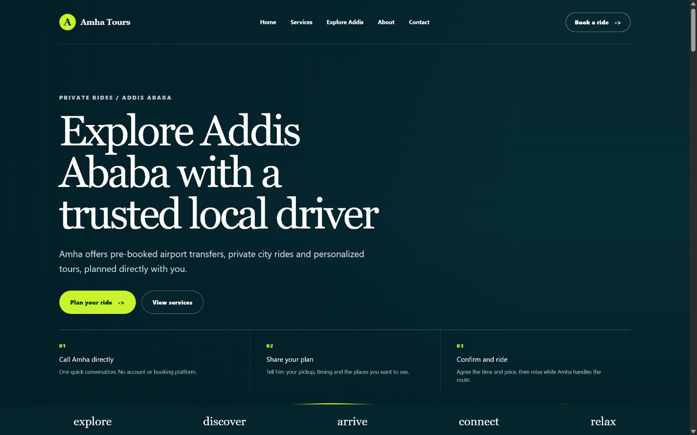
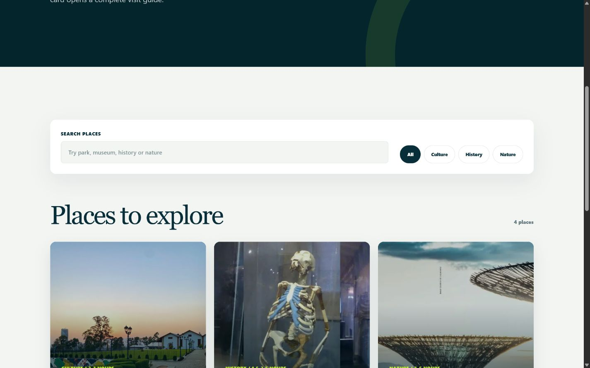

# Amha Tours

Amha Tours is a responsive travel website for private rides, airport transfers and personalized local tours in Addis Ababa. Visitors can explore destinations, review practical trip information and prepare a direct booking request without creating an account.

**Live website:** [amhatours.com.et](https://amhatours.com.et)

| Homepage | Place finder |
| :---: | :---: |
|  |  |

## What the website provides

- Responsive experience for desktop, tablet and mobile visitors.
- Searchable and filterable Addis Ababa destination directory.
- Detailed place guides with image galleries, travel time, highlights and activities.
- Booking forms that prefill the selected destination and prepare a WhatsApp request.
- Direct access to the business phone and social channels.
- SEO metadata, structured business data, sitemap and search-engine directives.

Client-facing content is managed through a protected dashboard. Authorized users can update the driver profile, hero content, services, places, descriptions, images, routes, pickup areas, testimonials and contact links without editing the frontend code.

## Technology

| Layer | Tools |
| --- | --- |
| Frontend | React 19, Next.js 16, TypeScript, CSS, React Icons |
| Production build | Static Next.js export served through Apache |
| Backend | PHP 8, PDO and JSON API endpoints |
| Database | MySQL with prepared statements |
| Administration | Secure PHP sessions, CSRF protection, password hashing, login throttling and remember-login cookies |
| Hosting | Ethio telecom Linux hosting with Plesk and SSL |
| Source control | Git and GitHub |

## How it works

The public React application loads immediately from static files and retrieves published content from the PHP API. Content changes made in `/admin/` are validated and stored in MySQL. Public booking requests are prepared in the visitor's browser and handed off to WhatsApp; the website does not store those inquiries.

## Local development

Node.js 20.19 or newer is recommended.

```bash
npm install
npm run dev
```

Open `http://localhost:3000`. The frontend uses built-in content when the PHP API is unavailable locally.

## Production build

```bash
npm run lint
npm run check:php
npm run build
```

The deployment-ready website is generated in `out/`. Server credentials belong only in the ignored `api/config.php` file and must never be committed. See [DEPLOYMENT.md](./DEPLOYMENT.md) for the Plesk deployment checklist.
